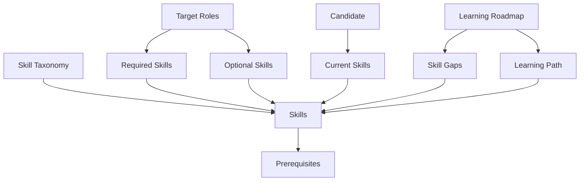

# Skill Gap Analysis & Learning Roadmap System

## Overview
A comprehensive data model for analyzing skill gaps and generating personalized learning roadmaps for candidates targeting specific roles.

## Data Model Components

### 1. Skill Taxonomy
- **40 Skills** across 4 categories:
  - **Frontend** (12 skills): HTML, CSS, JavaScript, TypeScript, React, Vue.js, Angular, Next.js, Tailwind CSS, Webpack, Redux, GraphQL Client
  - **Backend** (11 skills): Node.js, Express.js, Python, Django, FastAPI, REST API Design, GraphQL Server, Microservices, Auth, Message Queues, Caching
  - **DevOps** (9 skills): Git, Linux/Unix, Docker, Kubernetes, CI/CD, AWS, Terraform, Monitoring & Logging, Nginx
  - **Database** (8 skills): SQL Fundamentals, PostgreSQL, MySQL, MongoDB, Redis, Database Design, Query Optimization, Data Modeling

### 2. Skill Attributes
Each skill includes:
- **Difficulty**: 1-10 scale
- **Learning Time**: Estimated weeks to proficiency
- **Prerequisites**: Skill IDs that should be learned first
- **Description**: Clear explanation of the skill
- **Tags**: Categorization and searchability

### 3. Target Roles
6 comprehensive roles defined:
1. **Senior Full Stack Developer** (Senior, 5+ years)
2. **DevOps Engineer** (Mid, 3+ years)
3. **Frontend Architect** (Senior, 7+ years)
4. **Backend Engineer (Python)** (Mid, 3+ years)
5. **Database Administrator** (Senior, 5+ years)
6. **Cloud Solutions Architect** (Lead, 8+ years)

Each role specifies:
- Required skills with minimum proficiency levels
- Optional skills for competitive advantage
- Importance ratings (Critical/High/Medium/Low)
- Salary ranges

## File Structure

```
d:\cohort1\Performatives\
├── types\
│   └── skill-taxonomy.ts          # TypeScript interfaces
├── models\
│   └── pydantic-models.py         # Python Pydantic models
├── data\
│   └── seed-data.json             # Complete seed dataset
└── README.md                       # This file
```

## Key Features

### Prerequisite Chain
Skills are organized with realistic dependencies:
- React requires JavaScript
- TypeScript requires JavaScript
- Next.js requires React
- Kubernetes requires Docker
- Docker requires Linux/Unix
- GraphQL Server requires REST API Design

### Difficulty Progression
Skills are rated on difficulty:
- **Beginner (1-3)**: HTML, CSS, Git
- **Intermediate (4-6)**: JavaScript, Node.js, Docker, SQL
- **Advanced (7-8)**: React, Angular, Kubernetes, Microservices, Query Optimization
- **Expert (9-10)**: Kubernetes, Microservices Architecture

### Learning Time Estimates
Realistic time estimates based on industry standards:
- HTML: 2 weeks
- JavaScript: 8 weeks
- React: 6 weeks
- Kubernetes: 8 weeks
- AWS: 10 weeks

## Usage Examples

### TypeScript
```typescript
import { Skill, TargetRole, Candidate } from './types/skill-taxonomy';
import seedData from './data/seed-data.json';

// Access skills
const skills: Skill[] = seedData.taxonomy.skills;

// Access roles
const roles: TargetRole[] = seedData.target_roles;

// Find a specific skill
const reactSkill = skills.find(s => s.id === 'fe-005');
```

### Python
```python
from models.pydantic_models import Skill, TargetRole, SkillTaxonomy
import json

# Load seed data
with open('data/seed-data.json', 'r') as f:
    data = json.load(f)

# Parse with Pydantic for validation
taxonomy = SkillTaxonomy(**data['taxonomy'])
roles = [TargetRole(**role) for role in data['target_roles']]

# Access skills
for skill in taxonomy.skills:
    print(f"{skill.name}: {skill.difficulty}/10 difficulty")
```

## Data Relationships



## Next Steps

This data model is ready for:
1. **Gap Analysis Algorithm**: Compare candidate skills vs. role requirements
2. **Learning Path Generation**: Create ordered learning sequences respecting prerequisites
3. **Progress Tracking**: Monitor candidate skill development over time
4. **Recommendation Engine**: Suggest roles based on current skill sets
5. **UI Development**: Build interfaces for visualization and interaction

## Validation

Both TypeScript and Pydantic models include:
- Type safety and validation
- Constraint enforcement (e.g., difficulty 1-10, proficiency 1-10)
- Required field validation
- Email validation for candidates
- Proper date/time handling

---

**Version**: 1.0.0  
**Last Updated**: 2026-01-17
